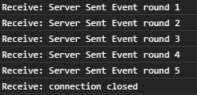

[](//packagist.org/packages/exinfinite/server-event)
[](//packagist.org/packages/exinfinite/server-event)
[](//packagist.org/packages/exinfinite/server-event)

# Server Send Event

[Server Send Event MDN參考](https://developer.mozilla.org/zh-TW/docs/Web/API/Server-sent_events/Using_server-sent_events)

### 安裝

```php
composer require exinfinite/server-event
```

### 使用

後端事件源 source.php
```php
use Exinfinite\ServerEvent;

$count = 1;
ServerEvent::setEvent('userconnect');//event type
while (true) {
    ServerEvent::setId($count);//event id
    ServerEvent::shot("Server Sent Event round {$count}");//event data
    if($count == '5'){
        ServerEvent::shot("connection closed");
        ServerEvent::close();//關閉連線
    }
    $count++;
    sleep(1);
}
```

前端接收 js
```js
var es = new EventSource("source.php");
es.addEventListener('userconnect', function(e) {//ServerEvent::setEvent('userconnect')
    console.log(`Receive: ${e.data}`);
}, false);
es.addEventListener('error', function(e) {//ServerEvent::close()時觸發
    es.close();
}, false);
```

執行結果

